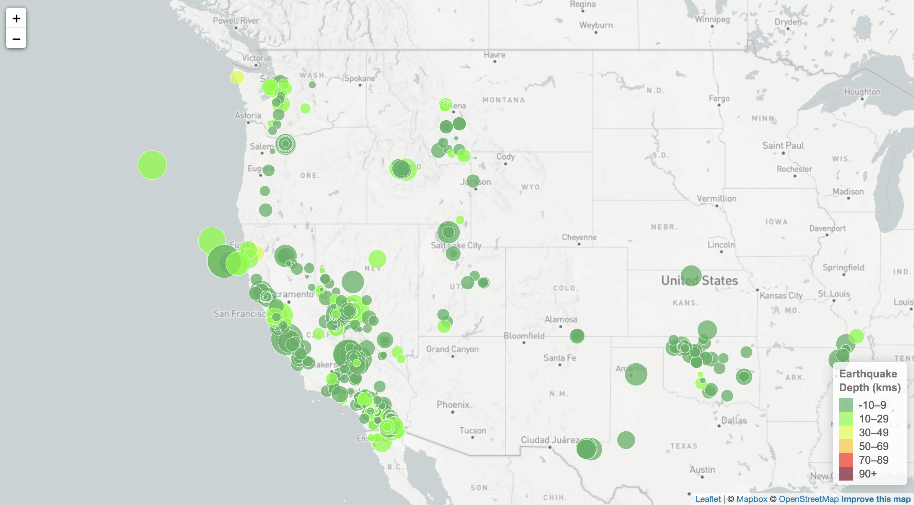
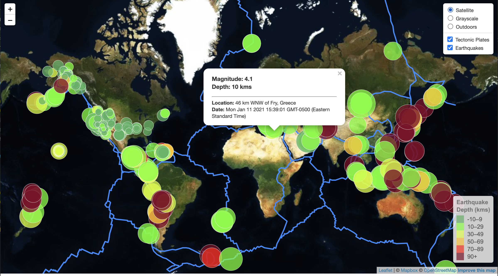

# leaflet-challenge

>  Build an interactive  map to visualize USGS's earthquake data using leaflet library.

## Table of contents
* [Level 1: Basic Visualization](#Level_1)
* [Level 2: More Data](#Level_2)
* [Contact](#Contact)

## Level 1: Basic Visualization

1.  Data set: 'All Earthquakes from the Past 7 Days'

2.  Create a map using Leaflet that plots all of the earthquakes from the data set based on their longitude and latitude.

3.  Data markers reflect the magnitude of the earthquake by their size and and depth of the earth quake by color. Earthquakes with higher magnitudes appear larger and earthquakes with greater depth appear darker in color.

4.  Added popups that provide additional information about the earthquake: Magnitude, Depth, Location and Date.

5.  Added a legend that provides context for the map data.

## Level 2: More Data

1.  Data set 1: 'All Earthquakes from the Past 7 Days'

2.  Data Set 2: tectonic plates

3.  Create a map using Leaflet with 3 options: Satellite, Grayscale and Outdoors

4.  Plot all of the earthquakes on the map from the data set based on their longitude and latitude.

5.  Plot a second data set on the map to illustrate the relationship between tectonic plates and seismic activity.

6.  Data markers reflect the magnitude of the earthquake by their size and and depth of the earth quake by color. Earthquakes with higher magnitudes appear larger and earthquakes with greater depth appear darker in color.

7.  Added popups that provide additional information about the earthquake: Magnitude, Depth, Location and Date.

8.  Added a legend that provides context for the map data.

## Contact
Created by [@deepavadakan](https://github.com/)